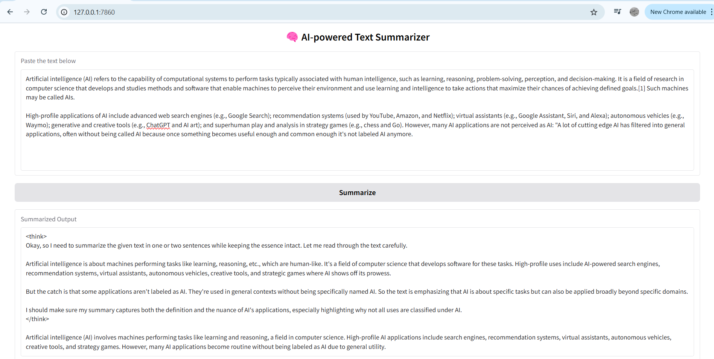

# 🧠 AI-powered Text Summarizer

This project is a lightweight, local-first web application that summarizes long paragraphs into concise, meaningful sentences using a Large Language Model (LLM) running on your own machine via [Ollama](https://ollama.com/). The app uses the DeepSeek LLM (`deepseek-r1:1.5b`) and a simple web interface built with [Gradio](https://gradio.app/) to make the experience intuitive and interactive.

---

## 🚀 Features

- 🔗 **Offline & Local**: Runs entirely on your machine via Ollama — no cloud dependencies.
- 🧠 **Powered by LLMs**: Uses `deepseek-r1:1.5b` for high-quality summarization.
- 🎛 **Simple UI**: Clean Gradio interface with side-by-side input/output experience.
- 🖼️ **Custom Styled**: Background overlay and centered title for a polished look.

---

## 📦 Tech Stack

| Tool         | Purpose                            |
|--------------|------------------------------------|
| Python       | Core language                      |
| Gradio       | Web interface                      |
| Requests     | API calls to Ollama server         |
| Ollama       | Runs the LLM locally               |
| DeepSeek-R1  | 1.5B parameter summarization model |

---

## 📸 Demo Preview

 <!-- (Add your screenshot image to the repo root and rename this if needed) -->

---

## 🛠️ How It Works

The app sends your input paragraph to the DeepSeek model through a local Ollama endpoint:

```http
POST http://localhost:11434/api/generate
